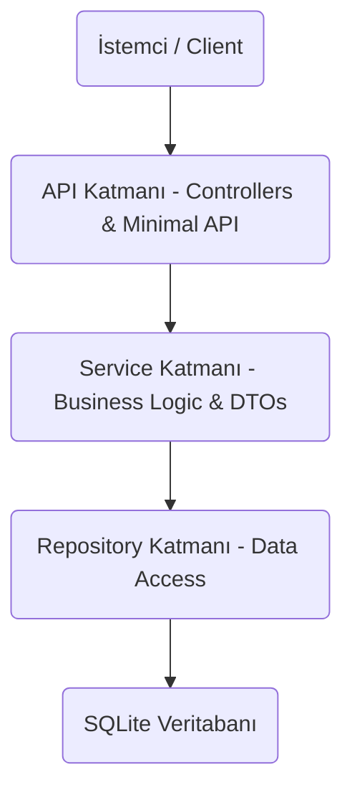

# .NET 9 REST API Projesi

Bu proje, **Yazılım Mimarileri** dersi kapsamında geliştirilmiştir. .NET 9 platformu üzerinde, **Katmanlı Mimari (Layered Architecture)** prensiplerine uygun olarak tasarlanmış, **Entity Framework Core** ve **SQLite** kullanan kapsamlı bir RESTful API uygulamasıdır. 

Projede, modern ve klasik yaklaşımları bir arada sunmak adına hem **Controller Base** hem de **Minimal API** yapıları hibrit olarak uygulanmıştır.

## 🚀 Proje Özellikleri

* **Platform:** .NET 9
* **Veritabanı:** SQLite
* **ORM:** Entity Framework Core (Code-First)
* **Mimari:** Katmanlı Mimari (N-Layered Architecture)
* **Tasarım Desenleri:** Generic Repository Pattern, Dependency Injection (DI)
* **API Yaklaşımı:** Hybrid (Controller & Minimal API Endpoint'leri bir arada)
* **Dökümantasyon:** Swagger / OpenAPI
* **Veri Transferi:** DTO (Data Transfer Objects) kullanımı
* **Response Modeli:** Generic Wrapper (`{ success, message, data }`)

## 📊 Mimari Yapı ve Diyagram

Proje 4 temel katmandan oluşmaktadır. Veri akışı ve katmanlar arası ilişki aşağıdaki diyagramda gösterilmiştir:

Katman Açıklamaları
Data Layer: Veritabanı bağlamı (AppDbContext) ve Varlıklar (Entities) bulunur.

Repository Layer: Veri erişim işlevlerini soyutlayan Generic Repository yapısı bulunur.

Service Layer: İş mantığı (Business Logic), Validasyonlar ve Entity-DTO dönüşümleri yapılır.

API Layer (Presentation): Dış dünyaya açılan kapı (Controllers & Minimal Endpoints).

🛠️ Kurulum ve Çalıştırma
Projeyi yerel makinenizde çalıştırmak için aşağıdaki adımları izleyin:

Projeyi Klonlayın:

Bash

git clone https://github.com/berkantt03/yazilim-mimarileri-proje.git
cd Net9RestApi
Bağımlılıkları Yükleyin:

Bash

dotnet restore
Veritabanını Oluşturun (Migration):

Bash

dotnet ef database update
Projeyi Çalıştırın:

Bash

dotnet run
Swagger Arayüzünü Açın: Tarayıcınızda http://localhost:5209/swagger adresine gidin.

🔗 Endpoint Listesi
Proje gereksinimleri doğrultusunda API, aynı işlevleri hem Controller hem de Minimal API üzerinden sunmaktadır.

1. Users (Controller Yapısı)
Metot	URL	Açıklama
GET	/api/users	Tüm kullanıcıları listeler
GET	/api/users/{id}	ID'ye göre kullanıcı getirir
POST	/api/users	Yeni kullanıcı oluşturur
PUT	/api/users/{id}	Kullanıcı bilgilerini günceller
DELETE	/api/users/{id}	Kullanıcıyı siler

E-Tablolar'a aktar

2. Users (Minimal API Yapısı)
Metot	URL	Açıklama
GET	/api/minimal/users	Tüm kullanıcıları listeler
GET	/api/minimal/users/{id}	ID'ye göre kullanıcı getirir
POST	/api/minimal/users	Yeni kullanıcı oluşturur
PUT	/api/minimal/users/{id}	Kullanıcıyı günceller
DELETE	/api/minimal/users/{id}	Kullanıcıyı siler

E-Tablolar'a aktar

📝 Örnek API Cevabı (Response Model)
Tüm endpointler standartlaştırılmış bir formatta cevap döner:

Başarılı İstek:

JSON

{
  "success": true,
  "message": "İşlem başarılı",
  "data": {
    "id": 1,
    "userName": "Berkant",
    "email": "berkant@example.com",
    "createdAt": "2025-01-11T12:00:00Z"
  }
}
Hatalı İstek:

JSON

{
  "success": false,
  "message": "Kullanıcı bulunamadı",
  "data": null
}
📝 Logging Stratejisi
Projede Microsoft.Extensions.Logging kütüphanesi (Built-in .NET Logging) kullanılmıştır. Harici bir bağımlılık yaratmamak ve .NET 9'un native performansından faydalanmak adına, varsayılan loglama mekanizması tercih edilmiştir.

Nasıl Çalışır?
Uygulama yaşam döngüsü boyunca oluşan kritik olaylar, hatalar ve bilgi mesajları Console ve Debug çıkışlarına yönlendirilir.

Log Seviyeleri: Development ortamında Information ve üzeri, Production ortamında Error ve üzeri loglar kayıt altına alınır.

Yapılandırma: Log seviyeleri appsettings.json dosyasından yönetilmektedir.

Kullanım: Dependency Injection (DI) aracılığıyla ILogger<T> arayüzü servis ve controller katmanlarına enjekte edilerek sistemin sağlık durumu izlenebilir.

Örnek appsettings.json Yapılandırması:

JSON

"Logging": {
  "LogLevel": {
    "Default": "Information",
    "Microsoft.AspNetCore": "Warning"
  }
}
